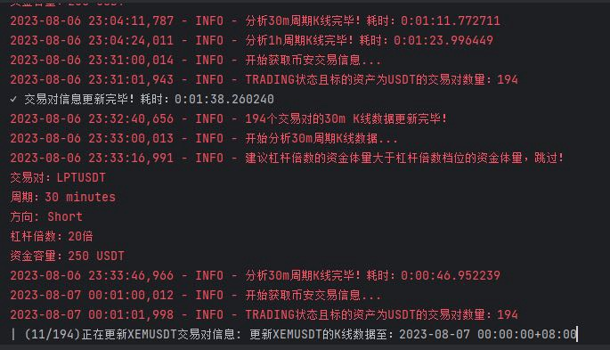
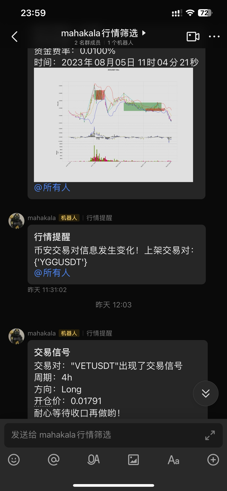
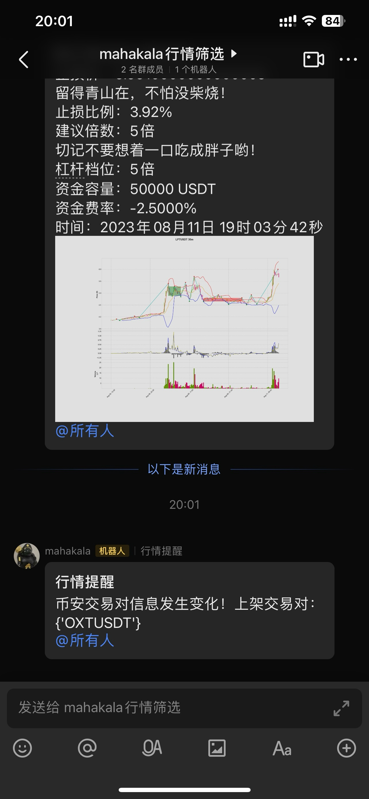
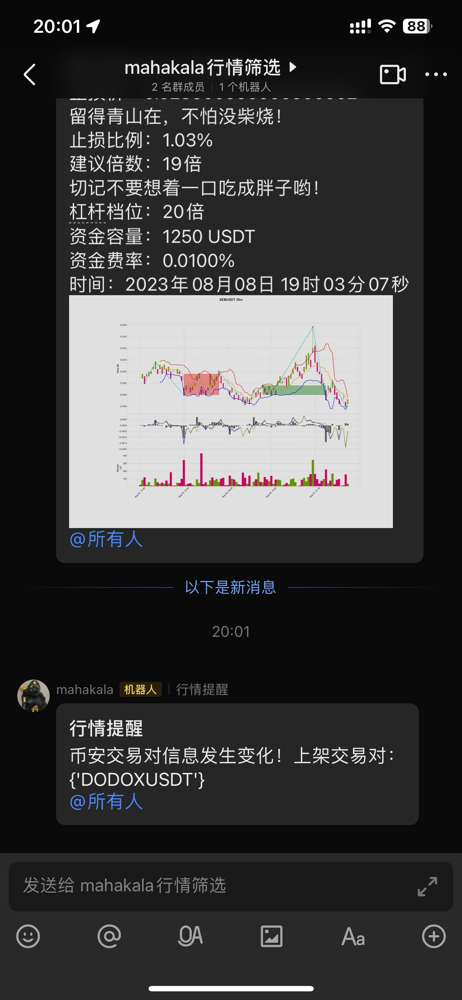

# mahakala-python

这是一个弃用项目，因为mahakala的python版本已经被新版的[mahakala](https://github.com/A1anSong/mahakala)替代

数据库基于TimescaleDB时序数据库扩展

只接入了币安永续合约的数据

以下是一些以往提醒的信息界面：

### TODO:
1. 改为每个周期一次性发送所有交易对的提示
2. 可能会有center_price引发的bug
3. 资金容量考虑改为当前倍数而不是当前档位的资金容量
4. 考虑中枢合并的情况